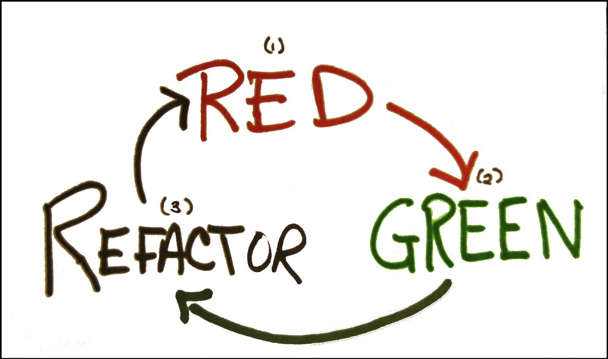

# 构筑测试体系

一套测试就是一个强大的bug侦测器，能够大大缩减查找bug所需的时间。

需要确保所有测试都完全自动化，让它们检查自己的测试结果。

撰写测试代码的最好时机是在开始动手编码之前。

预先写好的测试代码为工作安上一个明确的结束标志：一旦测试代码正常运行，工作就可以结束了。

Kent Beck将这种先写测试的习惯提炼成一门技艺，叫**测试驱动开发(Test-Driven Development，TDD)**。

## TDD

通俗的比喻：没有测试用例的项目最后看起来就像被胶带粘在一起一样！

### 什么是软件测试？

软件测试是评估软件项目的过程，以检测给定输入和预期输出之间的差异。测试评估产品的质量。软件测试是一个应该在开发过程中进行的过程。换句话说，软件测试是一个验证过程。

### 什么是TDD？

测试驱动开发(TDD)是一种渐进的开发方法，它结合了测试优先的开发，即在编写足够的产品代码来完成测试和重构之前编写测试。换句话说，这是在编写函数代码之前考虑需求或设计的一种方法。

### 如何做？

需要了解的第一件事是，按照TDD(规程)编写代码与直接解决问题(不进行测试)是(稍微)不同的方法。

这三个阶段分别代表什么呢？

- 编写失败的测试—充分理解(用户)需求/故事，以编写所期望的测试。(测试初始化应该是失败的— 因此它是"红"的)
- 使失败的测试通过— 编写能让测试通过的代码，直到确保所有已存在/先前的测试都还能通过
- 重构你写的代码— 如果在需要发布当前特性之前，有时间整理编写的代码，使其更简单(以便将来的自己或同事能够理解)，那么就这么做。

> 值得庆幸的是，因为您将拥有良好的测试，所以不需要预先进行任何重构，如果发现性能瓶颈，总是可以在稍后进行重构。大多数编程语言都有非常高效的编译器/解释器，可以消除大部分重构需求。如果您使用linter，您的代码将自然地“整洁”。

为了养成这种习惯，需要成功地使用TDD(以及一般的软件工程)，我们需要首先编写一个测试(并观察它失败)，然后编写使测试通过所需的代码。

在编写代码之前编写一个失败的测试，乍一看可能会违反直觉、耗时甚至"乏味"。但可以这么想：

- 测试就是你提出的问题
- 你的代码做出了对问题的答案
- 通过有一个清晰的问题，可以总是在编写代码过程中检查你的代码
- 因为它始终给的时相同的回答。不用感到惊讶，即使使用的是一个大型的、相互依赖的代码库！

#### The First Test

在Test First Development(TFD)中，首先写测试，然后再写代码让测试通过。

## 在Vue中实践TDD

对于UI组件来说，覆盖率并不是很重要的指标，这会导致我们过分关注组件的内部实现细节，从而导致琐碎的测试。

最好的方式的是将测试撰写为断言组件的公共接口，并在一个黑盒内部处理它。如断言一些输入(用户的交互或prop的改变)，是否导致预期结果(渲染结果或触发自定义事件)。

Vue Test Utils可以和各种主流的测试运行器(test runner)配合使用。但选用测试测试运行器需要考虑一些事项：功能集合、性能和对单文件组件预编译的支持等。推荐使用[Jest](https://jestjs.io/docs/zh-Hans/getting-started)和[mocha-webpack](https://github.com/zinserjan/mocha-webpack)。

- Jest功能最全。默认安装jsdom，内置断言且命令行的用户体验好。
- mocha-webpack是webpack+Mocha的包裹器，同时包含了接口和侦听模式。

